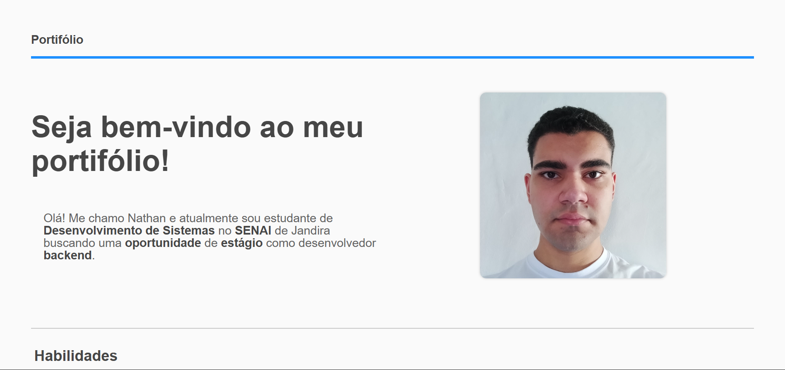

# Portifólio

Captura de tela do topo do site.

## Navegação
- [Sobre o Projeto](#sobre-o-projeto)
- [Tecnologias Utilizadas](#tecnologias-utilizadas)
- [Visualizando o Projeto](#visualizando-o-projeto)
- [Autor](#autor)

## Sobre o Projeto
Portifólio responsivo que mostra informações sobre mim para me apresentar ao mercado de trabalho. Foi construído usando HTML, CSS e JavaScript. Feito como atividade da matéria de Projeto de Software do SENAI.

## Tecnologias Utilizadas
- JavaScript
- HTML
- CSS

## Visualizando o Projeto
O projeto pode ser visualizado [aqui](https://znathan2303.github.io/portifolio-profissional/).

## Autor
[Nathan da Silva Costa](<https://www.linkedin.com/in/nathandasilvacosta/>)